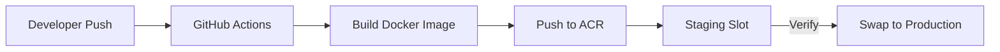

# GovKloud Docker Production Deployment

Industry-standard containerized deployment for Laravel on Azure App Service using a custom Docker image with Azure Container Registry (ACR).

---

## Why Docker for Production?

| Startup Script (Current) | Custom Docker Image (Production) |
|---|---|
| `sed` hacks nginx on every restart | Proper nginx config baked in |
| Depends on Azure's base image behavior | You control the entire runtime |
| Fragile if Azure changes defaults | Reproducible across environments |
| Can't customize PHP extensions easily | Full PHP config control |
| Not standard DevOps | Industry standard CI/CD pattern |

---

## Architecture Overview

```
GitHub Push → GitHub Actions → Build Docker Image → Push to ACR → Deploy to App Service
```



---

## Step 1: Create Azure Container Registry

```bash
# Create the registry
az acr create \
  --resource-group govkloud-rg \
  --name govkloudacr \
  --sku Basic \
  --admin-enabled true

# Get login credentials (save these for GitHub secrets)
az acr credential show --name govkloudacr
```

> [!NOTE]
> ACR Basic tier is ~$5/month. Sufficient for small teams.

---

## Step 2: Create the Dockerfile

Create `Dockerfile` in your project root:

```dockerfile
# =============================================================================
# Stage 1: Build dependencies
# =============================================================================
FROM composer:2 AS composer-build

WORKDIR /app
COPY composer.json composer.lock ./
RUN composer install \
    --no-dev \
    --no-interaction \
    --no-scripts \
    --optimize-autoloader \
    --prefer-dist

# =============================================================================
# Stage 2: Production image
# =============================================================================
FROM php:8.4-fpm-alpine AS production

# Install system dependencies
RUN apk add --no-cache \
    nginx \
    supervisor \
    curl \
    icu-dev \
    libzip-dev \
    mysql-client \
    oniguruma-dev \
    libpng-dev \
    libjpeg-turbo-dev \
    freetype-dev \
    ca-certificates

# Install PHP extensions
RUN docker-php-ext-configure gd --with-freetype --with-jpeg \
    && docker-php-ext-install \
    pdo_mysql \
    mbstring \
    intl \
    zip \
    bcmath \
    opcache \
    gd \
    pcntl

# Configure PHP for production
RUN mv "$PHP_INI_DIR/php.ini-production" "$PHP_INI_DIR/php.ini"
COPY docker/php/php-production.ini "$PHP_INI_DIR/conf.d/99-production.ini"
COPY docker/php/opcache.ini "$PHP_INI_DIR/conf.d/opcache.ini"
COPY docker/php/www.conf /usr/local/etc/php-fpm.d/www.conf

# Configure nginx
COPY docker/nginx/nginx.conf /etc/nginx/nginx.conf
COPY docker/nginx/default.conf /etc/nginx/http.d/default.conf

# Configure supervisor (manages nginx + php-fpm)
COPY docker/supervisor/supervisord.conf /etc/supervisor/conf.d/supervisord.conf

# Set working directory
WORKDIR /var/www/html

# Copy application code
COPY --chown=www-data:www-data . .

# Copy Composer dependencies from build stage
COPY --from=composer-build --chown=www-data:www-data /app/vendor ./vendor

# Create required directories
RUN mkdir -p \
    storage/framework/{cache/data,sessions,views} \
    storage/logs \
    bootstrap/cache \
    && chown -R www-data:www-data storage bootstrap/cache \
    && chmod -R 775 storage bootstrap/cache

# Create health check script
RUN echo '#!/bin/sh' > /healthcheck.sh \
    && echo 'curl -sf http://localhost:8080/ > /dev/null 2>&1' >> /healthcheck.sh \
    && chmod +x /healthcheck.sh

# SSH for Azure App Service (required for az webapp ssh)
RUN apk add --no-cache openssh \
    && echo "root:Docker!" | chpasswd \
    && ssh-keygen -A
COPY docker/sshd_config /etc/ssh/sshd_config

EXPOSE 8080 2222

HEALTHCHECK --interval=30s --timeout=5s --retries=3 CMD /healthcheck.sh

# Start via supervisor
CMD ["/usr/bin/supervisord", "-c", "/etc/supervisor/conf.d/supervisord.conf"]
```

---

## Step 3: Create Docker Configuration Files

### Directory Structure

```
project-root/
├── Dockerfile
├── .dockerignore
└── docker/
    ├── nginx/
    │   ├── nginx.conf
    │   └── default.conf
    ├── php/
    │   ├── php-production.ini
    │   ├── opcache.ini
    │   └── www.conf
    ├── supervisor/
    │   └── supervisord.conf
    └── sshd_config
```

---

### `.dockerignore`

```
.git
.github
.env
.env.*
node_modules
tests
storage/logs/*
storage/framework/cache/data/*
storage/framework/sessions/*
storage/framework/views/*
docs
*.md
docker-compose*.yml
```

---

### `docker/nginx/nginx.conf`

```nginx
worker_processes auto;
pid /run/nginx.pid;
error_log /var/log/nginx/error.log warn;

events {
    worker_connections 1024;
    multi_accept on;
}

http {
    include       /etc/nginx/mime.types;
    default_type  application/octet-stream;

    # Logging
    log_format main '$remote_addr - $remote_user [$time_local] "$request" '
                    '$status $body_bytes_sent "$http_referer" '
                    '"$http_user_agent"';
    access_log /var/log/nginx/access.log main;

    # Performance
    sendfile        on;
    tcp_nopush      on;
    tcp_nodelay     on;
    keepalive_timeout 65;
    types_hash_max_size 2048;
    client_max_body_size 64M;

    # Gzip
    gzip on;
    gzip_vary on;
    gzip_proxied any;
    gzip_comp_level 6;
    gzip_types text/plain text/css application/json application/javascript
               text/xml application/xml application/xml+rss text/javascript
               image/svg+xml;

    # Security headers
    add_header X-Frame-Options "SAMEORIGIN" always;
    add_header X-Content-Type-Options "nosniff" always;
    add_header X-XSS-Protection "1; mode=block" always;
    add_header Referrer-Policy "strict-origin-when-cross-origin" always;

    include /etc/nginx/http.d/*.conf;
}
```

---

### `docker/nginx/default.conf`

```nginx
server {
    listen 8080;
    listen [::]:8080;

    server_name _;
    root /var/www/html/public;
    index index.php;

    charset utf-8;

    # Laravel routing
    location / {
        try_files $uri $uri/ /index.php?$query_string;
    }

    # PHP-FPM
    location ~ \.php$ {
        fastcgi_pass 127.0.0.1:9000;
        fastcgi_param SCRIPT_FILENAME $realpath_root$fastcgi_script_name;
        include fastcgi_params;
        fastcgi_hide_header X-Powered-By;
        fastcgi_buffer_size 16k;
        fastcgi_buffers 4 16k;
    }

    # Block dotfiles (except .well-known)
    location ~ /\.(?!well-known).* {
        deny all;
    }

    # Cache static assets
    location ~* \.(css|js|jpg|jpeg|png|gif|ico|svg|woff|woff2|ttf|eot)$ {
        expires 30d;
        add_header Cache-Control "public, immutable";
        access_log off;
    }

    # Deny access to sensitive files
    location ~ /\.(env|git|svn) {
        deny all;
        return 404;
    }
}
```

---

### `docker/php/php-production.ini`

```ini
; Production PHP settings
display_errors = Off
display_startup_errors = Off
error_reporting = E_ALL & ~E_DEPRECATED & ~E_STRICT
log_errors = On
error_log = /var/log/php/error.log

; Performance
memory_limit = 256M
max_execution_time = 60
max_input_time = 60
post_max_size = 64M
upload_max_filesize = 64M

; Session
session.cookie_httponly = 1
session.cookie_secure = 1
session.use_strict_mode = 1

; Security
expose_php = Off
allow_url_fopen = Off
allow_url_include = Off
```

---

### `docker/php/opcache.ini`

```ini
[opcache]
opcache.enable=1
opcache.memory_consumption=256
opcache.interned_strings_buffer=16
opcache.max_accelerated_files=20000
opcache.validate_timestamps=0
opcache.save_comments=1
opcache.fast_shutdown=1
opcache.jit=1255
opcache.jit_buffer_size=128M
```

> [!IMPORTANT]
> `opcache.validate_timestamps=0` means PHP won't check if files changed. This is correct for production (max performance). For staging, set to `1`.

---

### `docker/php/www.conf`

```ini
[www]
user = www-data
group = www-data

listen = 127.0.0.1:9000

pm = dynamic
pm.max_children = 50
pm.start_servers = 5
pm.min_spare_servers = 5
pm.max_spare_servers = 35
pm.max_requests = 500

; Timeouts
request_terminate_timeout = 60s

; Status page (internal only)
pm.status_path = /fpm-status
ping.path = /fpm-ping

; Logging
catch_workers_output = yes
decorate_workers_output = no
```

---

### `docker/supervisor/supervisord.conf`

```ini
[supervisord]
nodaemon=true
user=root
logfile=/var/log/supervisor/supervisord.log
pidfile=/var/run/supervisord.pid

[program:nginx]
command=/usr/sbin/nginx -g "daemon off;"
autostart=true
autorestart=true
stdout_logfile=/dev/stdout
stdout_logfile_maxbytes=0
stderr_logfile=/dev/stderr
stderr_logfile_maxbytes=0

[program:php-fpm]
command=/usr/local/sbin/php-fpm --nodaemonize
autostart=true
autorestart=true
stdout_logfile=/dev/stdout
stdout_logfile_maxbytes=0
stderr_logfile=/dev/stderr
stderr_logfile_maxbytes=0

[program:sshd]
command=/usr/sbin/sshd -D
autostart=true
autorestart=true
```

---

### `docker/sshd_config`

```
Port 2222
ListenAddress 0.0.0.0
LoginGraceTime 180
X11Forwarding yes
Ciphers aes128-cbc,3des-cbc,aes256-cbc,aes128-ctr,aes192-ctr,aes256-ctr
MACs hmac-sha1,hmac-sha1-96
StrictModes yes
SyslogFacility DAEMON
PasswordAuthentication yes
PermitEmptyPasswords no
PermitRootLogin yes
Subsystem sftp internal-sftp
```

> [!NOTE]
> Azure App Service requires SSH on port 2222 with root password `Docker!` for the `az webapp ssh` command to work.

---

## Step 4: Update GitHub Actions for Docker CI/CD

Replace `.github/workflows/azure-deploy.yml`:

```yaml
name: Build & Deploy Docker to Azure

on:
  push:
    branches: [main, master]

env:
  ACR_NAME: govkloudacr
  IMAGE_NAME: govkloud-app
  RESOURCE_GROUP: govkloud-rg
  APP_NAME: govkloud-app

jobs:
  build-and-push:
    runs-on: ubuntu-latest
    outputs:
      image_tag: ${{ steps.meta.outputs.tags }}

    steps:
      - name: Checkout code
        uses: actions/checkout@v4

      - name: Login to Azure Container Registry
        uses: azure/docker-login@v1
        with:
          login-server: ${{ env.ACR_NAME }}.azurecr.io
          username: ${{ secrets.ACR_USERNAME }}
          password: ${{ secrets.ACR_PASSWORD }}

      - name: Build and tag image
        id: meta
        run: |
          TAG="${{ env.ACR_NAME }}.azurecr.io/${{ env.IMAGE_NAME }}:${{ github.sha }}"
          LATEST="${{ env.ACR_NAME }}.azurecr.io/${{ env.IMAGE_NAME }}:latest"
          docker build -t $TAG -t $LATEST .
          echo "tags=$TAG" >> $GITHUB_OUTPUT

      - name: Push to ACR
        run: |
          docker push ${{ env.ACR_NAME }}.azurecr.io/${{ env.IMAGE_NAME }}:${{ github.sha }}
          docker push ${{ env.ACR_NAME }}.azurecr.io/${{ env.IMAGE_NAME }}:latest

  deploy-staging:
    needs: build-and-push
    runs-on: ubuntu-latest

    steps:
      - name: Login to Azure
        uses: azure/login@v1
        with:
          creds: ${{ secrets.AZURE_CREDENTIALS }}

      - name: Deploy to Staging Slot
        uses: azure/webapps-deploy@v2
        with:
          app-name: ${{ env.APP_NAME }}
          slot-name: staging
          images: ${{ needs.build-and-push.outputs.image_tag }}

      - name: Wait for staging to start
        run: sleep 60

      - name: Run Migrations on Staging
        uses: azure/CLI@v1
        with:
          inlineScript: |
            az webapp ssh --resource-group ${{ env.RESOURCE_GROUP }} \
              --name ${{ env.APP_NAME }} --slot staging \
              --command "cd /var/www/html && php artisan migrate --force"

      - name: Health Check
        run: |
          for i in {1..10}; do
            STATUS=$(curl -o /dev/null -s -w "%{http_code}" \
              https://${{ env.APP_NAME }}-staging.azurewebsites.net)
            if [ "$STATUS" -eq 200 ]; then
              echo "✅ Staging healthy (HTTP 200)"
              exit 0
            fi
            echo "Attempt $i: HTTP $STATUS, retrying in 10s..."
            sleep 10
          done
          echo "❌ Staging failed health check"
          exit 1
```

### GitHub Secrets to Add

| Secret | How to Get |
|---|---|
| `ACR_USERNAME` | `az acr credential show --name govkloudacr --query username -o tsv` |
| `ACR_PASSWORD` | `az acr credential show --name govkloudacr --query "passwords[0].value" -o tsv` |
| `AZURE_CREDENTIALS` | `az ad sp create-for-rbac --name github-deploy --role contributor --scopes /subscriptions/YOUR_SUB_ID/resourceGroups/govkloud-rg --sdk-auth` |

---

## Step 5: Configure App Service for Docker

Switch App Service from built-in PHP to custom container:

```bash
# Configure staging slot
az webapp config container set \
  --resource-group govkloud-rg \
  --name govkloud-app \
  --slot staging \
  --docker-custom-image-name govkloudacr.azurecr.io/govkloud-app:latest \
  --docker-registry-server-url https://govkloudacr.azurecr.io \
  --docker-registry-server-user $(az acr credential show --name govkloudacr --query username -o tsv) \
  --docker-registry-server-password $(az acr credential show --name govkloudacr --query "passwords[0].value" -o tsv)

# Configure production slot
az webapp config container set \
  --resource-group govkloud-rg \
  --name govkloud-app \
  --docker-custom-image-name govkloudacr.azurecr.io/govkloud-app:latest \
  --docker-registry-server-url https://govkloudacr.azurecr.io \
  --docker-registry-server-user $(az acr credential show --name govkloudacr --query username -o tsv) \
  --docker-registry-server-password $(az acr credential show --name govkloudacr --query "passwords[0].value" -o tsv)

# Remove the old startup script (no longer needed)
az webapp config set \
  --resource-group govkloud-rg \
  --name govkloud-app \
  --slot staging \
  --startup-file ""

az webapp config set \
  --resource-group govkloud-rg \
  --name govkloud-app \
  --startup-file ""
```

> [!WARNING]
> This replaces the `PHP|8.4` runtime with your custom Docker image. The startup script is no longer needed — nginx config is baked into the image.

---

## Step 6: Build & Test Locally

```bash
# Build
docker build -t govkloud-app .

# Run locally
docker run -p 8080:8080 \
  -e APP_KEY=base64:YOUR_KEY \
  -e APP_ENV=local \
  -e APP_DEBUG=true \
  -e DB_CONNECTION=mysql \
  -e DB_HOST=host.docker.internal \
  -e DB_DATABASE=govkloud \
  -e DB_USERNAME=root \
  -e DB_PASSWORD=password \
  govkloud-app

# Visit http://localhost:8080
```

---

## Step 7: Deploy & Swap

```bash
# Push code (triggers GitHub Actions automatically)
git add .
git commit -m "Add Docker production deployment"
git push origin master

# After staging passes health checks, swap to production
az webapp deployment slot swap \
  --resource-group govkloud-rg \
  --name govkloud-app \
  --slot staging \
  --target-slot production
```

---

## What This Gives You

| Feature | Before (Startup Script) | After (Docker) |
|---|---|---|
| nginx config | `sed` hack on every restart | Baked into image |
| PHP version | Depends on Azure | You control exactly |
| PHP extensions | Limited to Azure defaults | Install whatever you need |
| OPcache + JIT | Not configured | Optimized for production |
| Security headers | None | X-Frame-Options, nosniff, XSS |
| Static asset caching | None | 30-day cache headers |
| Gzip compression | Default | Optimized for web assets |
| Build reproducibility | Depends on Azure state | Identical every deploy |
| Local testing | Can't test Azure config locally | `docker run` matches prod |

---

## Production Checklist

- [ ] ACR created and credentials saved as GitHub secrets
- [ ] `AZURE_CREDENTIALS` service principal created
- [ ] All `docker/` config files committed
- [ ] `Dockerfile` and `.dockerignore` committed
- [ ] GitHub Actions workflow updated for Docker
- [ ] App Service switched to custom container
- [ ] Old startup script removed
- [ ] Environment variables configured on both slots
- [ ] Local Docker build tested
- [ ] Staging health check passes
- [ ] Swap to production verified

---

## Cost Impact

| Resource | Monthly Cost |
|---|---|
| ACR Basic | ~$5 |
| App Service (B1) | ~$13 (unchanged) |
| **Total Added** | **~$5/month** |
